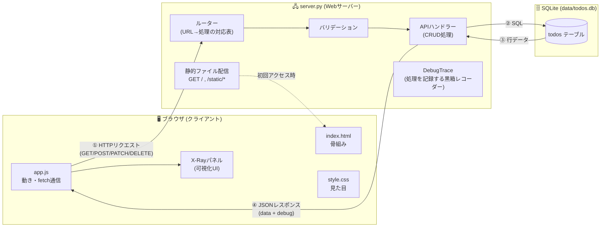
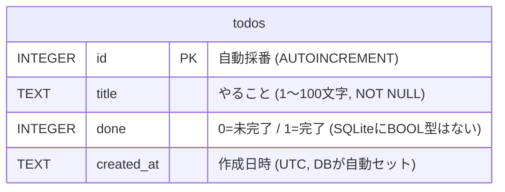
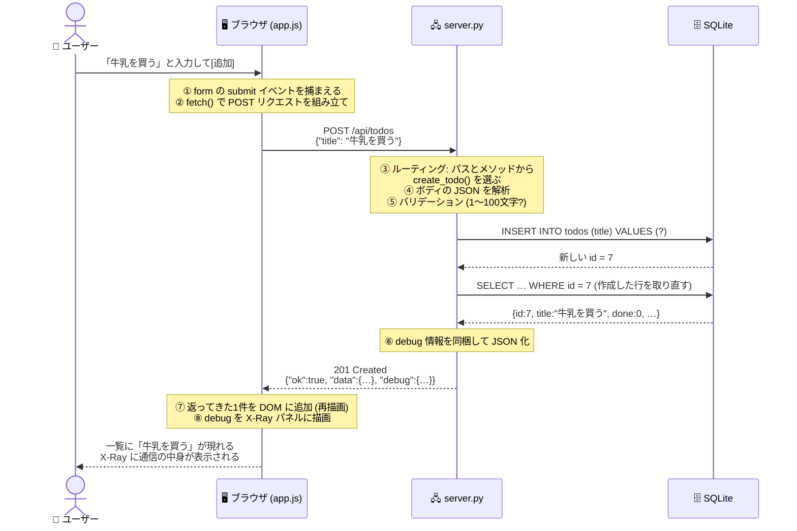

# Web Learning Lab 設計書

> 初学者が「Webアプリケーションの仕組み」を、**実際に動くアプリを透視(X-Ray)しながら**
> 体験的に理解するための教材Webアプリケーション。

このドキュメントは実装前に書かれた設計書です。実装は設計に忠実に行われています。
「なぜそう作ったか」も含めてすべて記載しているので、コードを読む前に一読することを推奨します。

---

## 1. 目的と対象読者

### 目的

Webアプリケーションの仕組み(ブラウザ・HTTP・サーバー・データベースの連携)を、
**抽象的な説明ではなく、目の前で動いている本物の通信・処理を観察することで**理解できるようにする。

### 対象読者

- プログラミングを始めたばかりで「Webアプリって何がどう動いてるの?」が分からない人
- HTML/CSS/JS を少し触ったが、サーバーやデータベースが霧の中にある人
- `fetch` や `API` という言葉は聞いたことがあるが、実物を見たことがない人

### 教材としての設計思想

| 思想 | 具体策 |
|------|--------|
| 「見えないものは理解できない」 | すべてのHTTP通信・SQL・サーバー内部処理をX-Rayパネルにリアルタイム表示 |
| 「本物であること」 | モックやアニメーションだけの疑似表示ではなく、実際に流れたリクエスト/レスポンス/SQLをそのまま表示 |
| 「1つの操作 = 1つの学び」 | TODOの追加/完了/削除がそれぞれ POST/PATCH/DELETE に対応し、CRUDとHTTPメソッドが1対1で結びつく |
| 「失敗からも学ぶ」 | 空文字入力→400、存在しないID→404 など、エラーも意図的に体験できる |
| 「コード自体が教科書」 | サーバー/フロントエンドのコードに初学者向けの日本語コメントを濃密に記述 |

---

## 2. 学習ゴール — 「全てわかる」の定義

このアプリを触り終えたとき、次の概念が **実物と紐づいた状態で** 説明できるようになる。

| # | 概念 | アプリのどこで学ぶか |
|---|------|---------------------|
| 1 | クライアント/サーバーモデル | X-Rayパネルの「旅の地図」(フロー図)全体 |
| 2 | URL の構造 (スキーム/ホスト/ポート/パス) | 教科書タブ「URLのしくみ」+ 実際のリクエスト行 |
| 3 | HTTPリクエストの構造 (行/ヘッダー/ボディ) | X-Ray「リクエスト」タブの生テキスト表示 |
| 4 | HTTPレスポンスの構造 (ステータス行/ヘッダー/ボディ) | X-Ray「レスポンス」タブ |
| 5 | HTTPメソッド (GET/POST/PATCH/DELETE) | TODO操作それぞれが異なるメソッドを発行 |
| 6 | ステータスコード (200/201/400/404) | 正常系 + 「実験」ボタンでエラーを意図的に発生 |
| 7 | JSON というデータ形式 | リクエスト/レスポンスボディの表示 |
| 8 | ルーティング (URLとプログラムの対応付け) | X-Ray「サーバー内部」タブの処理ステップ表示 |
| 9 | バリデーション (入力チェック) | サーバー内部ステップ + 400エラー体験 |
| 10 | データベースと SQL (SELECT/INSERT/UPDATE/DELETE) | X-Ray「サーバー内部」タブの実行SQL表示 |
| 11 | 永続化 (リロードしてもデータが残る理由) | ページ再読み込み→GETでDBから復元される様子 |
| 12 | フロントエンド(HTML/CSS/JS)の役割分担 | 教科書タブ + コードコメント |
| 13 | fetch API と非同期通信 (画面遷移しない更新) | 操作のたびにページ全体ではなく一部だけ更新される体験 |
| 14 | 開発者ツール(F12)での実物確認 | 教科書タブ「開発者ツールで本物を覗く」章 |

---

## 3. 要件定義

### 機能要件

**F1. TODOアプリ本体 (学習の「題材」)**
- F1-1: TODO の一覧表示 (GET /api/todos)
- F1-2: TODO の追加 (POST /api/todos) — タイトル必須・100文字以内
- F1-3: TODO の完了/未完了切り替え (PATCH /api/todos/{id})
- F1-4: TODO の削除 (DELETE /api/todos/{id})
- F1-5: データは SQLite に永続化され、ブラウザをリロードしても残る

**F2. X-Ray パネル (学習の「顕微鏡」)**
- F2-1: 操作のたびに「旅の地図」(ブラウザ→HTTP→サーバー→DB→…の6ステージ)を順番にハイライトし、各ステージの解説文(ナレーション)を表示する
- F2-2: 実際に送信した HTTP リクエストを生テキスト風に表示する
- F2-3: 実際に受信した HTTP レスポンス(ステータス行/主要ヘッダー/ボディJSON)を表示する
- F2-4: サーバー内部の処理ステップ(ルーティング→バリデーション→SQL実行→レスポンス生成)を、実測時間(ミリ秒)つきで表示する
- F2-5: 実行された SQL 文とパラメータ、影響行数を表示する
- F2-6: 通信履歴を一覧表示し、過去の通信をクリックで再表示できる
- F2-7: 「じっくりモード」で各ステージのアニメーションを遅くできる

**F3. 教科書タブ (体系的な解説)**
- F3-1: Webアプリの全体像 / URL / HTTP / メソッドとステータスコード / JSON / フロントエンド / バックエンド / データベース / 開発者ツール活用 / このアプリ自身の構成、の各章を図解つきで読める

**F4. 実験ボタン (エラー体験)**
- F4-1: 「わざと空のタイトルを送る」→ 400 Bad Request を観察
- F4-2: 「わざと存在しないIDを消す」→ 404 Not Found を観察

### 非機能要件

| 項目 | 要件 | 理由 |
|------|------|------|
| 依存ライブラリ | **ゼロ** (Python 3.11+ 標準ライブラリのみ) | `python3 server.py` だけで動く。環境構築でつまずかせない |
| フロントエンド | フレームワークなし (Vanilla HTML/CSS/JS) | 魔法を排除し、全行が読める状態にする |
| ビルド工程 | なし | 「保存してリロード」だけで変更が反映される体験 |
| コメント | 初学者向け日本語コメントを全ファイルに濃密に記述 | コード自体が教材 |
| 動作環境 | ローカルの `http://localhost:8000` | 外部通信なし・安全 |

### スコープ外 (意図的にやらないこと)

- ユーザー認証・セッション — 概念が多くなりすぎるため「拡張アイデア」の紹介に留める
- HTTPS/TLS — ローカル学習用のため平文HTTP。教科書内で概念のみ解説
- 本番デプロイ — 対象外 (教科書内でホスティングの概念のみ紹介)

---

## 4. 技術選定と理由

| レイヤー | 採用技術 | 不採用にしたもの | 理由 |
|----------|----------|------------------|------|
| Webサーバー | `http.server.ThreadingHTTPServer` (標準ライブラリ) | Flask / FastAPI | フレームワークは「ルーティング」「リクエスト解析」を隠蔽してしまう。標準ライブラリなら**リクエスト1本の処理を全行追える**うえ、pip install 不要 |
| データベース | `sqlite3` (標準ライブラリ) | PostgreSQL / MySQL | サーバー不要のファイル型DB。それでいて本物のSQLが学べる |
| フロントエンド | Vanilla JS + fetch API | React / Vue | 仮想DOMやビルドは初学者には「魔法」。`document.createElement` の素朴な世界から始めるべき |
| データ形式 | JSON | — | 現代のWeb APIの事実上の標準 |
| 可視化 | サーバーがレスポンスに `debug` 情報を同梱する方式 | 別ポートのWebSocket監視 | 「レスポンスに載せて返す」が最も仕組みが単純で、初学者がコードを追える。副次的に「レスポンスボディは自由に設計できる」ことも学べる |

---

## 5. 全体アーキテクチャ



ポイント: サーバーは処理しながら `DebugTrace` に「今何をしたか」を記録し、
レスポンス JSON の `debug` フィールドに同梱して返す。フロントエンドはそれを X-Ray パネルに描画する。
**可視化のためのデータも、普通のHTTPレスポンスで運ばれてくる**——これ自体が教材になっている。

---

## 6. 画面設計

### 画面構成 (1ページ・2ビュー切替)

```text
┌──────────────────────────────────────────────────────────────┐
│ 🔬 Web Learning Lab      [実験室] [教科書]     じっくりモード ⬤ │ ← ヘッダー
├──────────────────────────────────────────────────────────────┤
│ ◆ 実験室ビュー                                                │
│ ┌───────────────────┐ ┌────────────────────────────────────┐ │
│ │ 📝 TODOアプリ      │ │ 🩻 X-Ray パネル                     │ │
│ │ ┌───────────────┐ │ │ ┌────────────────────────────────┐ │ │
│ │ │[入力欄  ][追加]│ │ │ │ 旅の地図 (6ステージのフロー図)   │ │ │
│ │ └───────────────┘ │ │ │ 🖥→📮→🖧→🗄→📬→🖥 (順に点灯)     │ │ │
│ │ ☐ 牛乳を買う   🗑 │ │ └────────────────────────────────┘ │ │
│ │ ☑ 本を返す     🗑 │ │ │ ナレーション: いまサーバーがSQLを… │ │ │
│ │                   │ │ ├─[リクエスト][レスポンス][サーバー内部][履歴]─┤ │
│ │ 💥 実験コーナー    │ │ │ POST /api/todos HTTP/1.1          │ │ │
│ │ [空タイトルを送る] │ │ │ Content-Type: application/json    │ │ │
│ │ [存在しないIDを削除]│ │ │ {"title": "牛乳を買う"}           │ │ │
│ └───────────────────┘ └────────────────────────────────────┘ │
├──────────────────────────────────────────────────────────────┤
│ ◆ 教科書ビュー (タブ切替で表示)                                │
│   第1章 Webアプリケーションとは / 第2章 URLのしくみ / …        │
└──────────────────────────────────────────────────────────────┘
```

### 「旅の地図」の6ステージ定義

| # | ステージ | 点灯する場所 | ナレーション例 (POST時) |
|---|----------|--------------|--------------------------|
| 1 | JavaScript が動く | 🖥 ブラウザ | 「追加ボタンが押されたので、JavaScript が fetch() でリクエストを組み立てています」 |
| 2 | リクエスト送信 | 📮 HTTP(往路) | 「HTTPリクエストがネットワークを通ってサーバーへ届きます」 |
| 3 | サーバーが受付・検証 | 🖧 サーバー | 「サーバーがURLを見て担当処理を決め(ルーティング)、入力をチェックしています」 |
| 4 | SQL 実行 | 🗄 データベース | 「INSERT 文でデータベースに1行書き込んでいます」 |
| 5 | レスポンス返送 | 📬 HTTP(復路) | 「結果を JSON にまとめ、ステータス 201 Created で返しています」 |
| 6 | 画面を更新 | 🖥 ブラウザ | 「JavaScript が受け取った JSON をもとに、ページを移動せず一覧だけ描き直しました」 |

- 通常モード: 1ステージ約 0.35 秒 / じっくりモード: 約 1.2 秒
- アニメーションは演出だが、**表示される中身(リクエスト・SQL・所要時間)はすべて実測値**

---

## 7. API 設計

### エンドポイント一覧

| メソッド | パス | 意味 | 成功時 | 主なエラー |
|----------|------|------|--------|------------|
| GET | `/` , `/static/*` | 画面(静的ファイル)の配信 | 200 | 404 |
| GET | `/api/todos` | TODO 一覧の取得 | 200 | — |
| POST | `/api/todos` | TODO の追加 | **201 Created** | 400 (タイトル空/長すぎ/JSON壊れ) |
| PATCH | `/api/todos/{id}` | TODO の部分更新 (done / title) | 200 | 400, 404 (ID不存在) |
| DELETE | `/api/todos/{id}` | TODO の削除 | 200 | 404 |

### レスポンス封筒 (envelope) 仕様

すべての API レスポンスは次の形に統一する。**`debug` が本アプリの心臓部**。

```jsonc
{
  "ok": true,                    // 成功したか
  "data": [ /* TODOの配列 or 1件 */ ],
  "error": null,                 // 失敗時: {"message": "タイトルを入力してください"}
  "debug": {                     // ★サーバー内部の記録 (X-Rayパネルの表示元)
    "method": "POST",
    "path": "/api/todos",
    "steps": [                   // サーバーが実際に踏んだ処理ステップ
      {"name": "ルーティング", "detail": "POST /api/todos → create_todo() が担当", "at_ms": 0.02},
      {"name": "ボディ解析",   "detail": "JSON 24バイトを読み取り", "at_ms": 0.08},
      {"name": "バリデーション", "detail": "title は1〜100文字 → OK", "at_ms": 0.10},
      {"name": "SQL実行",      "detail": "INSERT で1行追加 (id=7)", "at_ms": 0.95},
      {"name": "レスポンス生成", "detail": "201 Created / JSON 312バイト", "at_ms": 1.10}
    ],
    "sql": [                     // 実際に実行されたSQL
      {"query": "INSERT INTO todos (title) VALUES (?)", "params": ["牛乳を買う"], "rows": 1}
    ],
    "total_ms": 1.2              // サーバー内での総処理時間
  }
}
```

設計判断: `debug` を常時同梱する(本番アプリなら消す情報)。教材として
「サーバーは何でもレスポンスに載せて返せる」「本番では内部情報を晒さない」の両方を学べる。

### エラー設計

- 400 Bad Request — クライアントの送信内容が不正 (空タイトル・101文字以上・JSONとして壊れている)
- 404 Not Found — 存在しない ID への PATCH/DELETE、未知のパス
- 405 Method Not Allowed — 定義外メソッド (例: PUT /api/todos)
- エラー時も `debug.steps` に「どこで弾いたか」を記録する (失敗の可視化)

---

## 8. データベース設計

### ER 図



### DDL

```sql
CREATE TABLE IF NOT EXISTS todos (
    id         INTEGER PRIMARY KEY AUTOINCREMENT,  -- 追加のたびに 1,2,3… と自動採番
    title      TEXT    NOT NULL,                   -- 空文字はアプリ側バリデーションで拒否
    done       INTEGER NOT NULL DEFAULT 0,         -- 0/1 で真偽を表す
    created_at TEXT    NOT NULL DEFAULT (datetime('now'))
);
```

テーブルは1つだけにする。初学者の学習対象は「テーブル設計」ではなく
「アプリとDBがSQLで会話している」という事実そのものだから。

### 使用する SQL (全4種 = CRUD と1対1)

| 操作 | SQL | HTTPメソッド |
|------|-----|--------------|
| Read | `SELECT id, title, done, created_at FROM todos ORDER BY id` | GET |
| Create | `INSERT INTO todos (title) VALUES (?)` | POST |
| Update | `UPDATE todos SET done = ? WHERE id = ?` ほか | PATCH |
| Delete | `DELETE FROM todos WHERE id = ?` | DELETE |

`?` プレースホルダーを必ず使う(SQLインジェクション対策)。教科書章でも解説する。

---

## 9. 処理フロー (代表例: TODO 追加)



---

## 10. 可視化 (X-Ray) の設計詳細

### データの流れ

1. `app.js` の共通関数 `apiCall()` がすべての fetch を仲介する
2. 送信前: リクエストの生テキスト(リクエスト行・ヘッダー・ボディ)を組み立てて記録
3. 受信後: ステータス行・主要レスポンスヘッダー・ボディ(整形JSON)を記録
4. ボディ内 `debug` からサーバー内部ステップと SQL を取り出す
5. 1〜4 を「通信レコード」として履歴に積み、X-Ray パネルへ描画
6. 並行して「旅の地図」を6ステージ順に点灯させ、ナレーションを流す

### X-Ray パネルのタブ構成

| タブ | 表示内容 | 学べること |
|------|----------|------------|
| リクエスト | `POST /api/todos HTTP/1.1` + ヘッダー + ボディの生テキスト風表示 | HTTPリクエストの3層構造 |
| レスポンス | `HTTP/1.1 201 Created` + ヘッダー + 整形JSON | ステータスコード・レスポンス構造 |
| サーバー内部 | debug.steps の表 (処理名/詳細/経過ms) + 実行SQL | ルーティング・バリデーション・SQL |
| 履歴 | この画面で発生した全通信のリスト (クリックで再表示) | 操作とHTTPの対応関係の俯瞰 |

---

## 11. ディレクトリ構成

```text
learning-lab/
├── DESIGN.md          # 本設計書
├── README.md          # 起動方法・学習の進め方
├── server.py          # バックエンド (標準ライブラリのみ・単一ファイル)
├── test_server.py     # APIの自動テスト (unittest / pytest 両対応)
├── static/
│   ├── index.html     # 画面の骨組み (実験室 + 教科書の全章)
│   ├── style.css      # 見た目
│   └── app.js         # 動き (TODO操作・fetch・X-Ray描画)
└── data/
    └── todos.db       # SQLite データベース (初回起動時に自動生成 / git管理外)
```

単一ファイルサーバーにこだわる理由: 初学者が「上から下に読めば全部わかる」状態を守るため。
役割分割の美学より、視線移動の少なさを優先した。

---

## 12. 動作確認とテスト

### 起動

```bash
cd learning-lab
python3 server.py          # → http://localhost:8000
python3 server.py 8080     # ポート指定も可能
```

### 自動テスト

`test_server.py` が一時DBを使って実サーバーを起動し、HTTP 経由で CRUD・エラー系を検証する。

```bash
cd learning-lab
python3 test_server.py           # unittest として実行
# または (リポジトリの dev 環境がある場合)
uv run pytest learning-lab/ -v
```

検証項目: 一覧取得 / 追加(201) / 更新 / 削除 / 空タイトル400 / 不存在ID404 /
未知パス404 / debug 情報の同梱 / 静的ファイル配信。

※ リポジトリ本体の CI (`pytest` は `tests/` のみ収集) には影響を与えない独立構成。

---

## 13. 拡張アイデア (学習の次の一歩)

本体には入れず、学び終えた人への宿題として README で提示する。

1. **検索機能** — `GET /api/todos?q=牛乳` でクエリ文字列と `WHERE title LIKE ?` を学ぶ
2. **並び替え・期限** — カラム追加と `ALTER TABLE`、`ORDER BY` を学ぶ
3. **ユーザー認証** — Cookie とセッションの概念へ進む
4. **公開してみる** — HTTPS・ドメイン・ホスティングの世界へ進む
